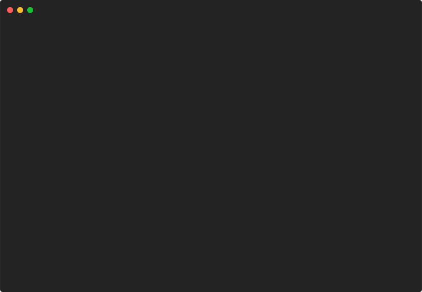

# barchart/mixed-values



```go
package main

import (
	"github.com/pterm/pterm"
)

func main() {
	mixedBars := pterm.Bars{
		pterm.Bar{
			Label: "Bar 1",
			Value: 2,
		},
		pterm.Bar{
			Label: "Bar 2",
			Value: -3,
		},
		pterm.Bar{
			Label: "Bar 3",
			Value: -2,
		},
		pterm.Bar{
			Label: "Bar 4",
			Value: 5,
		},
		pterm.Bar{
			Label: "Longer Label",
			Value: 7,
		},
	}

	pterm.DefaultSection.Println("Chart example with mixed values (note screen space usage in case when ABSOLUTE values of negative and positive parts are differ too much)")
	_ = pterm.DefaultBarChart.WithBars(mixedBars).WithShowValue().Render()
	_ = pterm.DefaultBarChart.WithHorizontal().WithBars(mixedBars).WithShowValue().Render()
}

```
