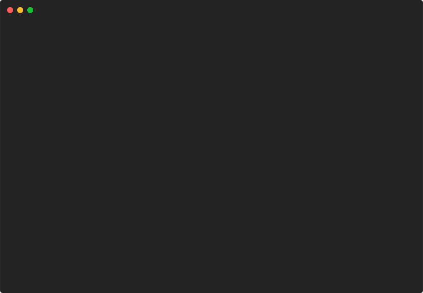

# barchart/show-value



```go
package main

import "github.com/pterm/pterm"

func main() {
	// Define a slice of bars for the bar chart. Each bar is represented by a struct
	// with a Label and a Value. The Label is a string that represents the name of the bar,
	// and the Value is an integer that represents the height of the bar.
	bars := []pterm.Bar{
		{Label: "A", Value: 10},
		{Label: "B", Value: 20},
		{Label: "C", Value: 30},
		{Label: "D", Value: 40},
		{Label: "E", Value: 50},
		{Label: "F", Value: 40},
		{Label: "G", Value: 30},
		{Label: "H", Value: 20},
		{Label: "I", Value: 10},
	}

	// Create a bar chart with the defined bars using the DefaultBarChart object from PTerm.
	// Chain the WithBars method to set the bars of the chart.
	// Chain the WithShowValue method to display the value of each bar on the chart.
	// Finally, call the Render method to display the chart.
	pterm.DefaultBarChart.WithBars(bars).WithShowValue().Render()
}

```
