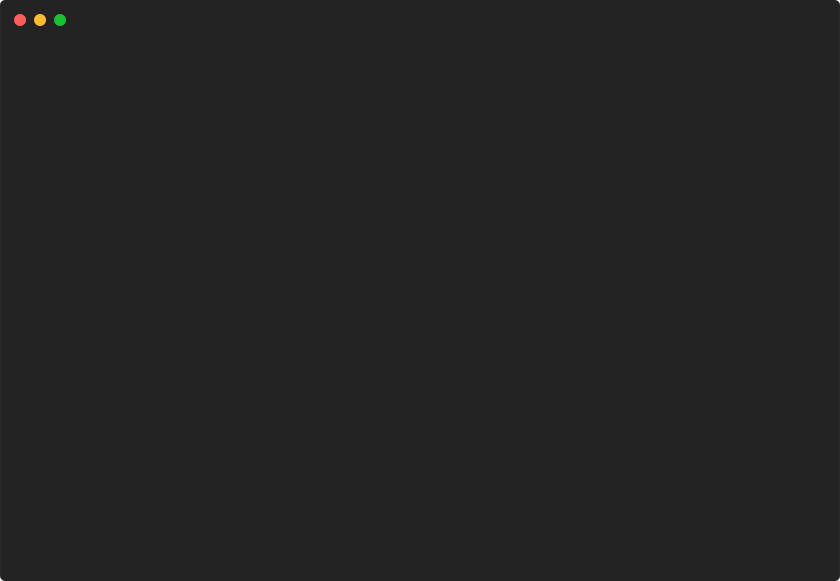

# bigtext



```go
package main

import "github.com/pterm/pterm"

func main() {
	// Print a large text with the LetterStyle from the standard theme.
	// Useful for title screens.
	pterm.DefaultBigText.WithLetters(pterm.NewLettersFromString("PTerm")).Render()

	// Print a large text with differently colored letters.
	pterm.DefaultBigText.WithLetters(
		pterm.NewLettersFromStringWithStyle("P", pterm.NewStyle(pterm.FgCyan)),
		pterm.NewLettersFromStringWithStyle("Term", pterm.NewStyle(pterm.FgLightMagenta))).
		Render()
}

```
