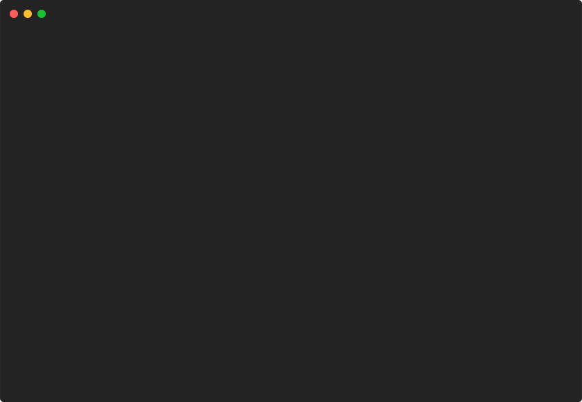

# bigtext/demo



```go
package main

import (
	"github.com/pterm/pterm"
	"github.com/pterm/pterm/putils"
)

func main() {
	// Print a large text with the LetterStyle from the standard theme.
	// Useful for title screens.
	pterm.DefaultBigText.WithLetters(putils.NewLettersFromString("PTerm")).Render()

	// Print a large text with differently colored letters.
	pterm.DefaultBigText.WithLetters(
		putils.NewLettersFromStringWithStyle("P", pterm.NewStyle(pterm.FgCyan)),
		putils.NewLettersFromStringWithStyle("Term", pterm.NewStyle(pterm.FgLightMagenta))).
		Render()

	// NewLettersFromStringWithRGB can be used to create a large text with a specific RGB color.
	pterm.DefaultBigText.WithLetters(
		putils.NewLettersFromStringWithRGB("PTerm", pterm.NewRGB(255, 215, 0))).
		Render()
}

```
