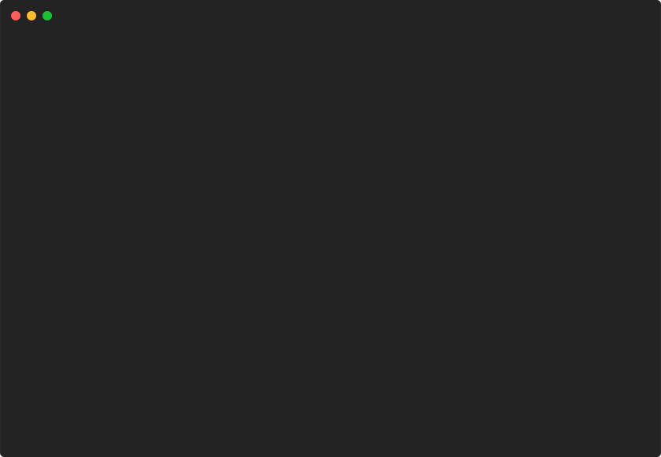

# bulletlist/customized



```go
package main

import (
	"github.com/pterm/pterm"
)

func main() {
	// Define a list of bullet list items with different styles and levels.
	bulletListItems := []pterm.BulletListItem{
		{
			Level:       0,                            // Level 0 (top level)
			Text:        "Blue",                       // Text to display
			TextStyle:   pterm.NewStyle(pterm.FgBlue), // Text color
			BulletStyle: pterm.NewStyle(pterm.FgRed),  // Bullet color
		},
		{
			Level:       1,                                  // Level 1 (sub-item)
			Text:        "Green",                            // Text to display
			TextStyle:   pterm.NewStyle(pterm.FgGreen),      // Text color
			Bullet:      "-",                                // Custom bullet symbol
			BulletStyle: pterm.NewStyle(pterm.FgLightWhite), // Bullet color
		},
		{
			Level:       2,                              // Level 2 (sub-sub-item)
			Text:        "Cyan",                         // Text to display
			TextStyle:   pterm.NewStyle(pterm.FgCyan),   // Text color
			Bullet:      ">",                            // Custom bullet symbol
			BulletStyle: pterm.NewStyle(pterm.FgYellow), // Bullet color
		},
	}

	// Create a bullet list with the defined items and render it.
	pterm.DefaultBulletList.WithItems(bulletListItems).Render()
}

```
