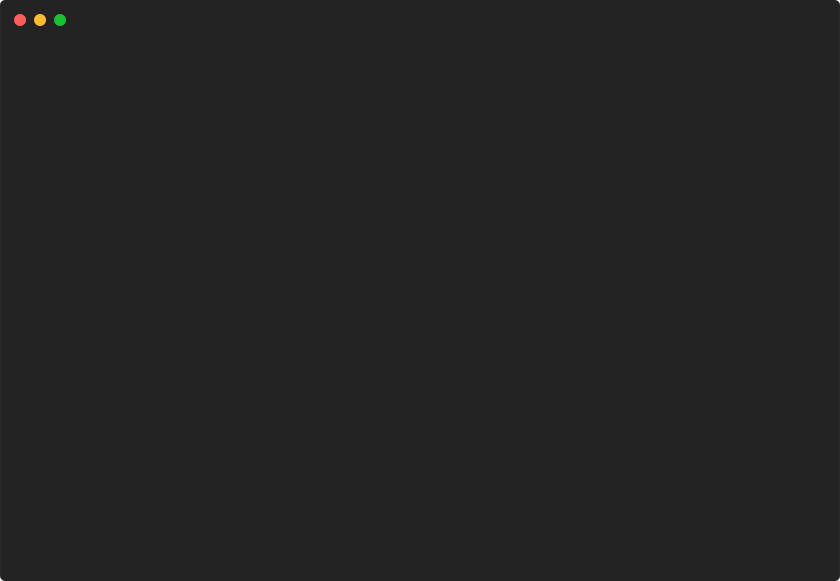

# table/boxed



```go
package main

import "github.com/pterm/pterm"

func main() {
	// Define the data for the table.
	// Each inner slice represents a row in the table.
	// The first row is considered as the header of the table.

	tableData := pterm.TableData{
		{"Firstname", "Lastname", "Email", "Note"},
		{"Paul", "Dean", "augue@velitAliquam.co.uk", ""},
		{"Callie", "Mckay", "nunc.sed@est.com", "这是一个测试, haha!"},
		{"Libby", "Camacho", "lobortis@semper.com", "just a test, hey!"},
		{"张", "小宝", "zhang@example.com", ""},
	}

	// Create an alternate color style for the rows.
	alternateStyle := pterm.NewStyle(pterm.BgDarkGray)

	// Create a table with the defined data.
	// The table has a header and is boxed.
	// Colors are used to alternate the rows.
	// Finally, render the table to print it.
	pterm.DefaultTable.WithHasHeader().WithBoxed().WithData(tableData).WithAlternateRowStyle(alternateStyle).Render()
}

```
